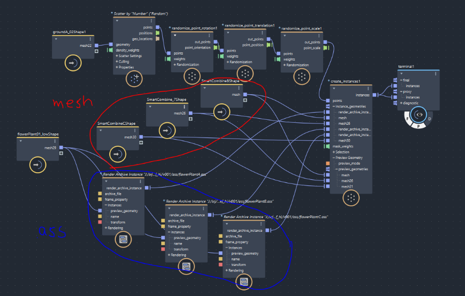

# Bifrost Tips

## Bifrost Instancing
### Avoid Mixing Input Types
Avoid mixing two different input types to create instances

🟥 Red = Raw meshes (incorrect, breaks instancing)
🟦 Blue = Archive standins (correct)

### Problem in This Graph
* Mixed inputs into create_instances1:
  * Raw meshes (SmartCombine, lowShape)
  * Archive standins (x/y/z.ass)
* Mesh inputs break instancing: each copy becomes unique geometry.
* Render log shows:
  * “could not acquire instance geometry” and Subdivs with 0 instances

### Standard Instancing Workflow
1. Export each plant variation as .ass or .usd standin archive.
2. Bring them into Bifrost with Render Archive Instance nodes.
3. Connect only these archives to create_instances1.instance_geometries.
4. Use preview_geometry input for low-res meshes (Maya viewport only).

### Real-life Analogy
* Decorating a hall with 1000 chairs:
  * Standins > Give one chair design > reuse 1000 times (pure instancing).
  * Raw meshes > Give wood planks > rebuild each chair from scratch (unique geometry).

---